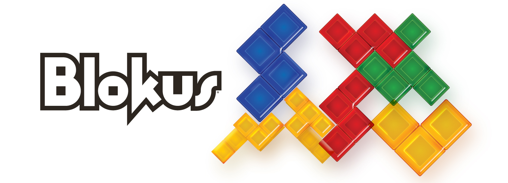
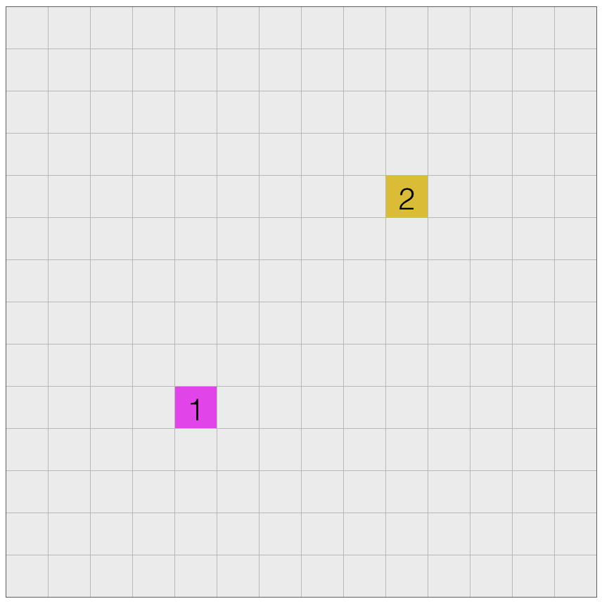
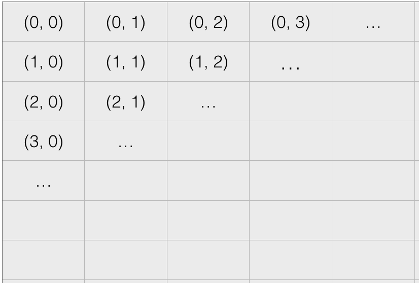

# BlokusHacker

> AI for Blokus

我们已经准备好了[中文README](README-CHS.md)，其中给出了一些更适合新手的指导。

***Still updating...***

[Blokus](http://www.mattelgames.com/en-us/blokus/index.html) is an abstract strategy board game for two to four players, invented by [Bernard Tavitian](https://en.wikipedia.org/wiki/Blokus#cite_note-2) and first released in 2000 by Sekkoïa, a French company. It has won several awards, including the Mensa Select award and the 2004 Teacher's Choice Award. 

*Image from http://www.mattelgames.com*

This project is for a competition of [USTC](ustc.edu). We hope students can develop various AIs for this wonderful game.

We'll provide a platform for AIs to fight with each other.

## Rules

The game is played on a square board divided into 20 rows and 20 columns, for a total of 400 squares. There are a total of 84 game tiles, organized into 21 shapes in each of four colors: blue, yellow, red and green. The 21 shapes are based on free polyominoes of from one to five squares (one monomino, one domino, two trominoes/triominoes, five tetrominoes, and 12 pentominoes).

The standard rules of play for all variations of the game are as follows:

* Order of play is either clockwise or counter-clockwise.
* The first piece played of each color is placed in one of the board's four corners. Each new piece played must be placed so that it touches at least one piece of the same color, with only corner-to-corner contact allowed—edges cannot touch. However, edge-to-edge contact is allowed when two pieces of different color are involved.
* When a player cannot place a piece, he or she passes, and play continues as normal. The game ends when no one can place a piece.
* When a game ends, the score is based on the number of squares in each player's pieces on the board (e.g. a tetromino is worth 4 points). If a player played all of his or her pieces, he or she gets a bonus score of +20 points if the last piece played was a monomino, +15 points otherwise.

## Restrictions

To be fair and simple, we only concern about the 2-player version:

* 14\*14 board, 1 color per player, first step must cover a special location.

The searching space for naive brute-force method is estimated to be 10^74 ~ 10^100, so you have to figure out some smart way.

**Indexing of the board:**

**Here's some remarkable standard for winners (optional):**

* Get the highest score while provided with enough time for thinking. (For example, 30sec/step)
* Get the highest score while provided with little time for thinking. (For example, 1sec/step)
* Without pre-training or pre-searching
* Scalable (Brute-force search will fail it)
* Uncommon or surprising methods
* Mining some tricks form AI
* *Other targets will be added later*

Your are honorable if matching any of these requests.

##Sample Program
###Blokus-0405.py
>The details are in `BlokusHacker/Example/site`.

We have provided a sample program for you to quickly write your own `BlokusHacker`. The kernel function is `getScores`, which represents the power of a `BlokusHacker`. 

If you don't want to spend time on writting the basic opperation, like `rotate, canPut, getDiagList and so on`, you can write your codes with the sample and it would be our honors **:)**.
